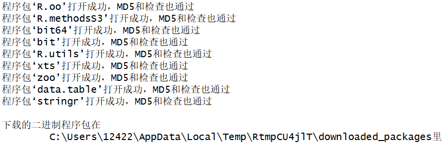
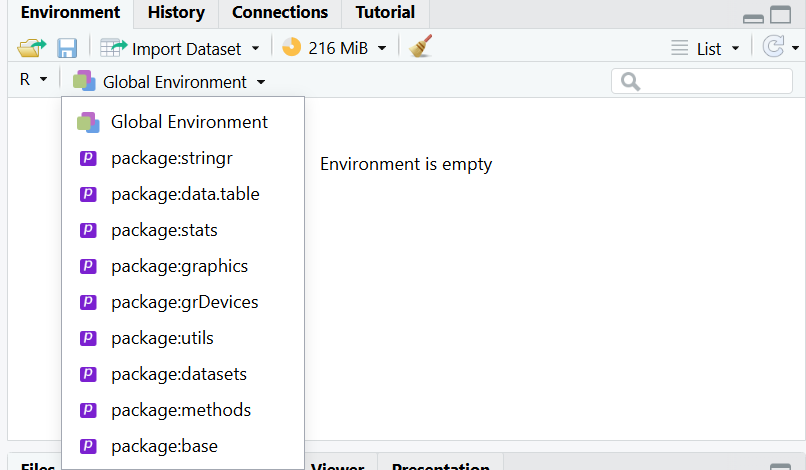
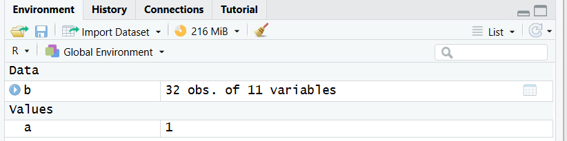

1.运行某一行:选中一行 Code –\> run selected line(s) 快捷键为Ctrl+Enter

运行多行代码:选中多行 Code –\> run selected line(s) 快捷键为Ctrl+Enter

运行整段代码: Code –\> Run Region –\> Run ALL 快捷键为Ctrl+Shift+Enter

2.Console窗口

3.install.packages()

4.library()

6.\<- 快捷键为Alt + -

7.Environment窗口

8.井号# 快捷键为Ctrl+Shift+C
